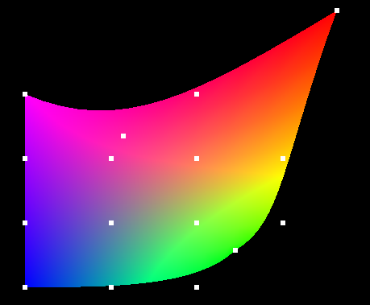
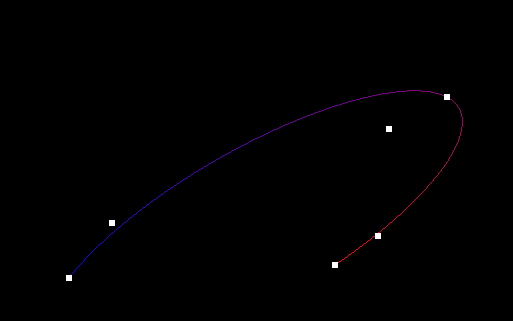

<!-- Copyright 2024 Kieran W Harvie. All rights reserved. -->

**:warning:Living Document: All Parts are Subject to Change:warning:**

# Tessellating Bézier Curves and Surface

	
	 
	    A Bicubic Bézier surface whoes trianglulation was calculated in the Tesselation shader. 
		Only the 16 white points where sent to the graphics card.
	 

	
	 
		A Conic section defined by three points and two tangents caulated as a rational quadratic Bézier curve.
		Only 3 points where sent to the graphics card.
	 

This repo demonstrates how to use OpenGL's tessellation shaders to render Bézier curves and surfaces.
These curves and surfaces are an intuitive, extendable, and numerically stable way to add character to renders.
The tessellation shaders provide a performance minded and memory efficient way to implement Bézier curves and surfaces in OpenGL,
what a great combination!

## Summaries

Looking at the structure of the tessellation shader I believe it was built for these types of operations.
As such the purpose of each file in the demonstrations follows naturally from their shader type,
which can be read about [here](https://lazyfoo.net/tutorials/SDL/index.php),
with main.c acting as minimal driving code to build the shanders and send them user input.
Hence the following table only gives a mathematical summary of each demonstration:

| Demonstration | Summary |
|--|--|
| cubic curve | Implementation of a [cubic Bézier curve](https://en.wikipedia.org/wiki/B%C3%A9zier_curve) which can be thought of as a smooth line between two end point and their tangents. |
| bicubic rectangle | Implementation of a [bicubic Bézier surface](https://en.wikipedia.org/wiki/B%C3%A9zier_surface) which can be thought of as a soft rectangle controlled by 16 points which can be used to 'pull' the rectangle towards them. |
| cubic triangle | Implementation of a [biquadratic Bézier surface](https://en.wikipedia.org/wiki/B%C3%A9zier_surface) which can be thought of as a soft triangle controlled by 10 points which can be used to 'pull' the triangle towards them. |
| conic section | Implementation of a [rational quadratic Bézier curve](https://en.wikipedia.org/wiki/B%C3%A9zier_curve#Rational_B%C3%A9zier_curves) which can be thought of as as the [conic section](https://en.wikipedia.org/wiki/Conic_section) between two endpoints, their tangents, and an arbitrary third point. |
| width and color | Implementation of a [cubic Bézier curve](https://en.wikipedia.org/wiki/B%C3%A9zier_curve) where both width and color are also parameterized by the control points alongside position. |

And more to come!

## Additional resources
- Set-up: For general SDL examples and set-up advice consider Lazy Foo' Productions [SDL Tutorials](https://lazyfoo.net/tutorials/SDL/index.php).
- Tessellation Shader: For background on the Tessellation Shader consult the OpenGL wiki's [Tessellation page](https://lazyfoo.net/tutorials/SDL/index.php).
- Mathematics: For further reading into how the presented algorithms work consider reading "[Curves and Surfaces for CAGD: A Practical Guide](https://books.google.com.au/books/about/Curves_and_Surfaces_for_CAGD.html?id=5HYTP1dIAp4C&source=kp_book_description&redir_esc=y)".

