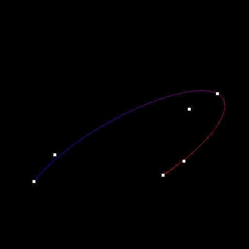

<!-- Copyright 2024 Kieran W Harvie. All rights reserved. -->

**:warning:Living Document: All Parts are Subject to Change:warning:**

# Tessellating Bézier Curves and Surface

	
	 
	    A Bicubic Bézier surface whoes trianglulation was calculated in the Tesselation shader. 
		Only the 16 white points where sent to the graphics card.
	 

	
	 
		A Conic section defined by three points and two tangents caulated as a rational quadratic Bézier curve.
		Only three points where sent to the graphics card.
	 

This repo demonstrates how to use OpenGL's tessellation shaders to render Bézier curves and surfaces.
Bézier curves and surfaces are an intuitive, extendable, and numerically stable way to add natural curves and character to renders.
The tessellation shaders provide a performance minded and memory efficient way to implement Bézier curves and surfaces in OpenGL,
what a great combination!

## Additional resources
- Set-up: For general SDL examples and set-up advice consider Lazy Foo' Productions [SDL Tutorials](https://lazyfoo.net/tutorials/SDL/index.php).
- Tessellation Shader: For background on the Tessellation Shader consult the OpenGL wiki's [Tessellation page](https://lazyfoo.net/tutorials/SDL/index.php).
- Mathematics: For further reading into how the presented algorithms work consider reading "[Curves and Surfaces for CAGD: A Practical Guide](https://books.google.com.au/books/about/Curves_and_Surfaces_for_CAGD.html?id=5HYTP1dIAp4C&source=kp_book_description&redir_esc=y)".

